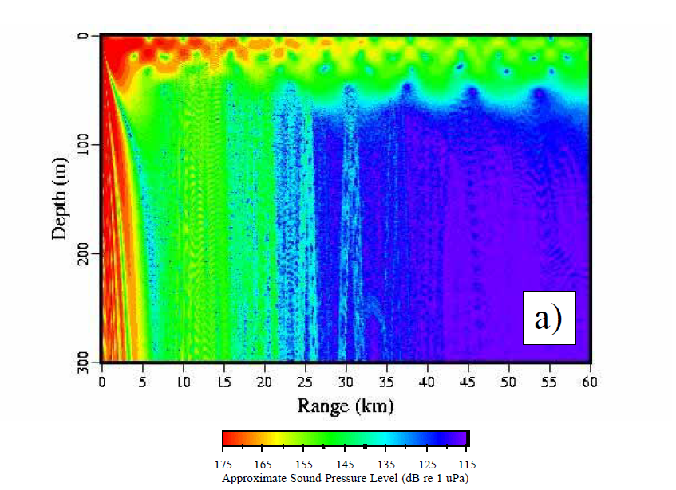

```{r setup, include=FALSE, message=FALSE, warning=FALSE}
knitr::opts_chunk$set(echo = TRUE)
library(mdsr)
library(sp)
library(leaflet)
library(tidyverse)
```

## Intro to Spatial Data

To plot the strandings for your homework assignment, you'll need to know how to make a map in R, and populate it with spatial data. We started this last week with the code to make a map of (some) of the strandings of beaked whales around the world. First we assembled the data:

```{r}
locations <- c('Bahamas', 'Canary_Islands', 'Madeira', 'Greece')
date <- as.Date(c('2000-03-14', '2002-09-24', '2000-05-10', '1996-05-12'), "%Y-%m-%d")
num_Zc <- c(11, 8, 3, 14)
lat <- c(26.905, 28.804022, 33.041934, 37.416491)
long <- c(-77.4829, -13.840395, -16.351554, 21.628179)

center_lat <- mean(lat)
center_long <- mean(long)

whales <- data.frame(locations, date, num_Zc, lat, long) 
whales
```

And we plotted that using the leaflet library, which makes an interactive javascript map:

```{r}
mybins <- seq(2, 15, by=2)
mypalette <- colorBin(palette="YlOrBr", domain=whales$num_Zc, na.color="transparent", bins=mybins)


# Prepare the text for the tooltip:
mytext <- paste(
  "Stranding Location: ", whales$locations, "<br/>", 
  "# Dead Ziphius: ", whales$num_Zc, sep="") %>%
  lapply(htmltools::HTML)

m <- leaflet(whales) %>% 
  addTiles()  %>% 
  setView( lat = center_lat, lng = center_long , zoom = 2) %>%
  addProviderTiles("Esri.OceanBasemap") %>%
  addCircleMarkers(~long, ~lat, 
                   fillColor = ~mypalette(num_Zc), fillOpacity = 0.7, color="white", radius=8, stroke=FALSE,
                   label = mytext,
                   labelOptions = labelOptions( style = list("font-weight" = "normal", padding = "3px 8px"), 
                                                textsize = "13px", direction = "auto")) %>% 
  addLegend( pal=mypalette, values=~num_Zc, opacity=0.9, title = "# Animals", position = "bottomright" )

m
```

That worked great, and since we went a little fast in class, let's look at building a new map using _some_ of the data from the Balcomb and Claridge (2001) paper, as well as the Joint Interim Report. 

For your homework, you can use this template as an example; you'll have to complete the assignment by building up the ships and the strandings. The information for the strandings is in Table 1 of Balcomb and Claridge (2001); the information for the ships is in the Fromm and McEachern report that I've placed on sakai (see below for more detail).

## Building up a Dataset
### Strandings
First, let's start with a stranding location from the paper. Specifically, let's look at the first entry from Table 1 - a spinner dolphin (the same species we'll examine at DUML). The data in that table are:

Animal ID  | Species | Location
------------- | ------------- | -------------
BMMS 00-01 Abaco  | _Stenella frontalis_ immature female | 26 $\infty$ 54.307'N 77 $\infty$ 28.974'W

So right off the bat, we'll need to clean things up a little - especially the way the latitude and longitude are formatted. As written, the spatial coordinates are in degrees, minutes and decimal minutes, but R can't ingest them as written. 

It's easiest to convert them to decimal degrees, and to do that you have to divide the minutes by degrees. There are 60 minutes in one degree, so the order of operations is to divide 54.307 by 60 and then add it to the degrees. Here's the R code to do that and to populate a vector called ```lat``` (short for latitude):

```{r}
lat <- 26 + 54.307 / 60
```

And then do the same thing for longitude, but note the operations look a little different. We are multiplying by -1 - why?:

```{r}
lon <- -1 * (77 + 28.974/ 60) 
```

First, since we are north of the equator, the latitude is positive, and second, since we are west of the Greenwich Meridian, longitude is negative - hence the multiplying by -1. If we were to denote this as positive instead with ```abs(lon)``` we'd get: `r abs(lon)`. This is a valid longitude, but not for this purpose!

Next we can specify the other information in the table as individual vectors:

```{r}
animal_id <- 'BMMS_00-01'
species <- 'S.frontalis'
```

Let's put them all together into a data frame - the most common data object in R and take a look at its contents:

```{r}
strandings <- data.frame(animal_id, species, lon, lat)
strandings
```

On to the ship locations...

### Ship Location
The map in the Joint Interim Report is pretty crappy and not that usable (do you think this was deliberate?). I reached out to the author of the sound propagation section - Dr. David Fromm, from the Naval Research Lab - and he sent me the entire sound prop report:

> ACOUSTIC MODELING RESULTS OF THE NEW PROVIDENCE CHANNEL FOR 15 MARCH 2000. Dr. David M. Fromm, NRL & Dr. James McEachern, ONR, 29 August 2000

> The report is in the resources section on sakai; the file is 2019-10-09_NPC_Report-final.pdf.

Therein, they note the locations of the ships with the different sonar types. Here's ship A from page 38:

Time (UTC)  | Lat   | Long  | Frequency (kHz)  | Source Level (dB)
------------- | ------------- | ------------- | ------------- | -------------
0700  | 26 13 N | 075 36 W  | 2.6   | 235 
0900  | 25 58 N | 076 50 W  | 2.6   | 235
1100  | 25 31 N | 077 15 W  | 2.6   | 235
1230  | 25 31 N | 077 30 W  | 3.3   | 235
1430  | 26 05 N | 077 50 W  | 3.3   | 235
1630  | 26 19 N | 078 13 W  | 3.3   | 225

In order to take this text and turn it into data that R can use to plot, we have to convert the text into a data frame again. We've done this a few times now; this time instead of making the individual vectors, I'm going to assemble it all in one go and then print it to the screen:

```{r}
ships <- data.frame(ship_ID = 'A',
                    time = c(as.POSIXct(strptime("2000-03-15 07:00:00", "%Y-%m-%d %H:%M:%S"), tz = "GMT"),
                             as.POSIXct(strptime("2000-03-15 09:00:00", "%Y-%m-%d %H:%M:%S"), tz = "GMT"),
                             as.POSIXct(strptime("2000-03-15 11:00:00", "%Y-%m-%d %H:%M:%S"), tz = "GMT"),
                             as.POSIXct(strptime("2000-03-15 12:30:00", "%Y-%m-%d %H:%M:%S"), tz = "GMT"),
                             as.POSIXct(strptime("2000-03-15 14:30:00", "%Y-%m-%d %H:%M:%S"), tz = "GMT"),
                             as.POSIXct(strptime("2000-03-15 16:30:00", "%Y-%m-%d %H:%M:%S"), tz = "GMT")),
                    lon = -1 * c(75 + 36/60, 76 + 50 / 60, 77 + 15/60, 77 + 30/60, 77 + 50/60, 78 + 13/60),
                    lat = c(26 + 13/60, 25 + 58/60, 25 + 31/60, 25 + 31/60, 26 + 05/60, 26 + 19/60),
                    frequency = c(2.6, 2.6, 2.6, 3.3, 3.3, 3.3),
                    source_level = c(235, 235, 235, 235, 235, 225))
ships
```

Ok! We have a ship's track through the area. Pretty cool. (n.b., for your homework, you may want to choose a ship for each member of your group and then share the code within your group. This way you don't all have to input the data 3 times, but make sure to error check.)

All we did in the above block of code was specify the vectors within the call to ```data.frame()```, which just saves us a step. Also note that dates and times can be _very_ fussy to get right in R. In fact they can be a collossal pain in the keister. 

However, with that fussy formatting I've used above, R now knows this is a date object. This allows us to do operations on the dates themselves, e.g. we can add 7 months to the date and look at the time difference between two points along the track:

```{r}
ships$time[1] + months(7)
ships$time[4] - ships$time[1]
```

If you stay working with R, I suggest learning the ```lubridate()``` package, which makes a lot of the date handling and manipulating easier. 

## Spatial Data
### Plot the Ship Track
We now have enough to plot the ship onto the map. So we can repurpose the plotting code from above. But of course, we have to change the inputs to plot what we want. Now I'm color coding the points based on the source level of the ship, and we change the pop-up text. 

You may wonder how I chose the default zoom and location of the map. (You may also wonder what I mean by that!) 

By zoom I mean how far zoomed in or out we are from where the data are. The higher the number, the greater the zoom (this is in the ```setView()``` command). Try it at ```zoom = 2```, and then again at ```zoom = 12``` to see the difference. You have to re-source the code each time to make the changes. 

> **Pedagogical aside:** If this is confusing at this point, no problem. To help get your head around it, imagine you were using a recipe that a friend gave you to make chocolate chip cookies. You used the ingredients, and baked the cookies, but they turned out terribly. You call your friend, who happens to be a pastry chef, and they say "oh sorry, I made a mistake, I meant 1 cup of butter, not 1 Tablespoon." 

> You go ahead and change the recipe on a sheet of paper, but to get new cookies, you have to make the whole batch over again - this time with the right amount of butter. If you just change the recipe (think - change the code) but don't cook it again, you still are stuck with the crappy cookies from the first iteration. 

> Each time we make a change to the code (recipe), we need to re-run it, otherwise R won't do anything new.

And by location, I mean where the map is centered. Using the ```setView()``` command again, you can specify where to center the map. 

After some trial exploratory analysis, I chose to center it on the 14:30 location of ship A. But you can also change this and see what you get. Try ```lat = 38.8977, lon = -77.0365``` to see what you get. And by try, I mean swap these values for the ones I've put in the code block below. I've commented these out for you, so just uncomment them (remove the pound sign) and re-run the block of code.

Let's plot the track of the ship:

```{r}
mybins <- seq(220, 245, by=5)
mypalette <- colorBin(palette="Reds", domain=ships$source_level, na.color="transparent", bins=mybins)

center_lat <- 26.08333
center_long <- -77.83333

# Trial new map center
# center_lat <- 38.8977
# center_long <- -77.0365

# Prepare the text for the tooltip:
mytext <- paste(
  "Ship ID: ", ships$ship_ID, "<br/>", 
  "Location at Time: ", ships$time, "<br/>", 
  "SPL (dB): ", ships$source_level, sep="") %>%
  lapply(htmltools::HTML)

m <- leaflet(ships) %>% 
  addTiles()  %>% 
  setView( lat = center_lat, lng = center_long, zoom = 8) %>%
  addProviderTiles("Esri.OceanBasemap") %>%
  addCircleMarkers(~lon, ~lat, 
                   fillColor = ~mypalette(source_level), fillOpacity = 0.7, color="white", radius=8, stroke=FALSE,
                   label = mytext,
                   labelOptions = labelOptions( style = list("font-weight" = "normal", padding = "3px 8px"), 
                                                textsize = "13px", direction = "auto")) %>% 
  addLegend(pal=mypalette, values=~source_level, opacity=0.9, title = "Source Level (dB)", position = "bottomright" )

m
```

So that looks cool, but we can improve this - no? What if we wanted to add the stranding to the map? What would we need to add? Well the data from the whale, of course, but we might also want to change the text for the tooltip, i.e. what you get when you hover your cursor over the point. Test this by sourcing the block, and by hovering your mouse over the whale marker and over a ship location to see the difference. 

```{r}
m2 <- m %>% 
addMarkers(data = strandings, ~lon, ~lat, popup = ~as.character(species), label = ~as.character(species))
m2
```

What else might we want? **All** the strandings and **all** the ships of course! For homework I'm going to ask you to plot **all** the data, so here I'll just show one example. The strandings data are in Table 1 of Balcomb and Claridge (2001), and the ship data are in the Fromm and McEachren report (pages 38, 40, 42, and 44).

Let's see an example of how we might build up the data sets. Let's add one more whale, and one point from one ship. I'll leave it as homework for you to do the rest. One way you might want to do this is to make the complete data sets in one go as I demonstrated above. Here I'll just add one row to each existing data frame - first the whales (in the ```strandings``` data frame):

```{r, warning=FALSE, message=FALSE}
new_sight <- data.frame(animal_id = "BMMS_00_05", species = 'M.densirostris', lon = -1 * (77 + 31.163/60), lat = 26 + 05.908/60)
strandings <- bind_rows(strandings, new_sight)
strandings
```

Then ship B. Here I add one time from Ship B to the ```ships``` data frame. I grabbed the information from page 40 of the Fromm report:

```{r, warning=FALSE, message=FALSE}
shipB <- data.frame(ship_ID = 'B',
                    time = as.POSIXct(strptime("2000-03-15 14:30:00", "%Y-%m-%d %H:%M:%S"), tz = "GMT"),
                    lon = -1 * (79 + 3.1/60),
                    lat = 26 + 22/60,
                    frequency = 2.6,
                    source_level = 240)
ships <- bind_rows(ships, shipB)
```

Finally, let's plot it. 

> Aside - Note that we have to source the ```mytext``` block again to account for the fact that we've added a new ship to the ```ships``` data frame. In your homework, you'll do the data assembly all at once, and avoid having to make this double sourcing of the code.

Also, here I'm adding the updated data to the existing map, ```m``` to create a new map object called ```m3```.

```{r}
mytext <- paste(
  "Ship ID: ", ships$ship_ID, "<br/>", 
  "Location at Time: ", ships$time, "<br/>", 
  "SPL (dB): ", ships$source_level, sep="") %>%
  lapply(htmltools::HTML)

m3 <- m %>% 
  addMarkers(data = strandings, ~lon, ~lat, popup = ~as.character(paste(animal_id, species, sep = ": ")), 
             label = ~as.character(paste(animal_id, species, sep = ": "))) %>% 
  addCircleMarkers(data = ships, ~lon, ~lat, 
                   fillColor = ~mypalette(source_level), fillOpacity = 0.7, color="white", radius=8, stroke=FALSE,
                   label = mytext,
                   labelOptions = labelOptions( style = list("font-weight" = "normal", padding = "3px 8px"), 
                                                textsize = "13px", direction = "auto")) 
m3
```

Ok, channeling my inner Bob Ross I think this "happy little map" looks great. 

> Important aside: on the off chance that you do not know who Bob Ross is, first - he rules:


> Second, his programs are surprisingly effective for relaxation. See https://www.youtube.com/watch?v=lLWEXRAnQd0 for example. Remember this (and the puppies!) at exam time. 

## Adding Sonar
Let's turn this map up to 11 and add in a buffer on the ship's position to get a feel for how much of the North East Providence channel was ensonified. To do this, I'm going to select a distance from the ship where source level exceeds *135* dB. For your homework, you can choose whatever you want as long as you can defend it based on the figure and on Table III from the Fromm report, and on our readings and in-class discussion. Here's a snapshot of the acoustic field from the NRL report:



Based on this figure and Table III.1b in the report, I'm going to choose 60km. 

How do we then buffer the ships point to show the ensonification in the channel? We add a circle to the map for one location (the 1430 time for Ship A), and specify the radius in meters - 60000m for 60km.

**Before you run this, what do you think it will look like?**

```{r}
m4 <- m3 %>% 
  addCircles(data = ships[5, ], ~lon, ~lat, radius = 60000,
                   fillColor = ~mypalette(source_level), fillOpacity = 0.1, color="white", stroke=FALSE,
                   label = mytext,
                   labelOptions = labelOptions( style = list("font-weight" = "normal", padding = "3px 8px"), 
                                                textsize = "13px", direction = "auto")) 
m4
```

## Summary
This buffer shows the amount of area at the surface where Sound Pressure Levels exceeded 135 dB for one (of 4) ships in the Northeast Providence Channel. What does this tell you about the whales experienced in the channel?
